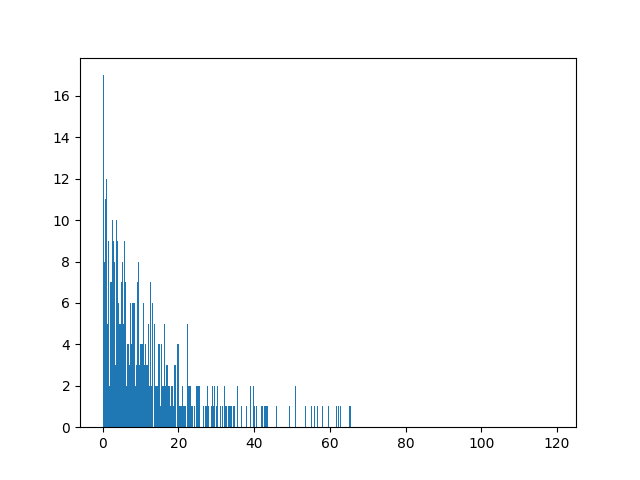
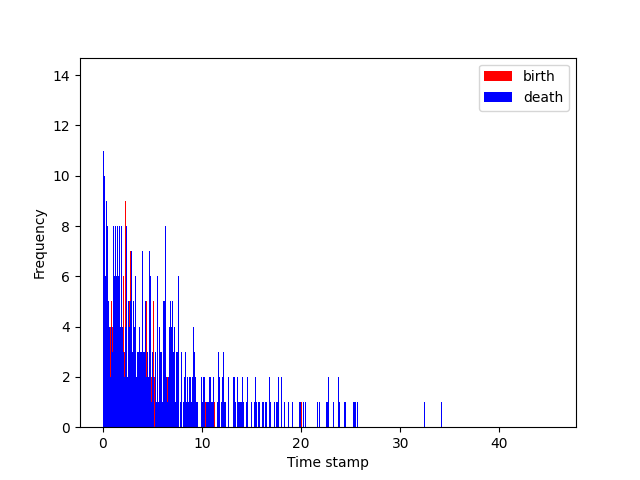

# The growth trend for single species
Time begins with 0 and moves forward.
There is a parameter called 'birth_lambda' which controls the time stamp of birth events.
```markdown
birth_lambda = 0.1
number_of_births = 10
birth_time = [np.random.exponential(1/birth_lambda) for i in range(number_of_births)]
```
Say if we want to create at 10 birth events, we can use the above code to generate 10 time stamps for birth events.
```markdown
[8.23198078616695, 31.72194375522901, 30.85169352827397, 10.878434021257064, 0.0347701153291832, 6.1704514906031855, 40.1050484095005, 38.637635486516466, 6.80766193651622, 1.0916474255963606]
```
The above list is the time stamps for 10 birth events.
If we want to create 1000 birth events, it would look like this:

The x-axis is the time stamp for birth events, and the y-axis is the number of birth events.
Why I use this method because I don't want any one to live forever, and I want to have a random time stamp for birth events.
Also, I want to have a random time stamp for death events.

Just make sure that the death time stamp is always greater than the birth time stamp. If it is not, then regenerate the death time stamp for one individual.
and so far, we have parameters:
```markdown
birth_lambda: to control the time stamp for birth events
death_lambda: to control the time stamp for death events
number_of_individuals: Initial starting number of individuals
```
As far as I am concerned, the number of individuals cannot increase forever, because there is a limit for the resources. 
And I need a parameter to control the potential offspring for each individual.
```markdown
num_offspring: randomly generated number of offspring by possion distribution
population_limit: the limit for the population
```
The chance for an individual born is` (1 - population.size / population.pop_limit)`.
In addition, a child will be born near its parent. The location of the child is its parent's location (x+location_noise, y+location_noise).
I think that's all for the growth trend for single species.


