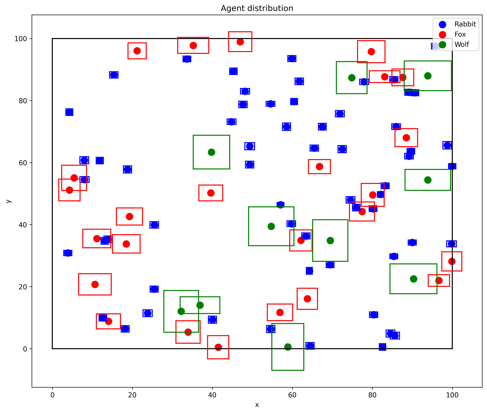
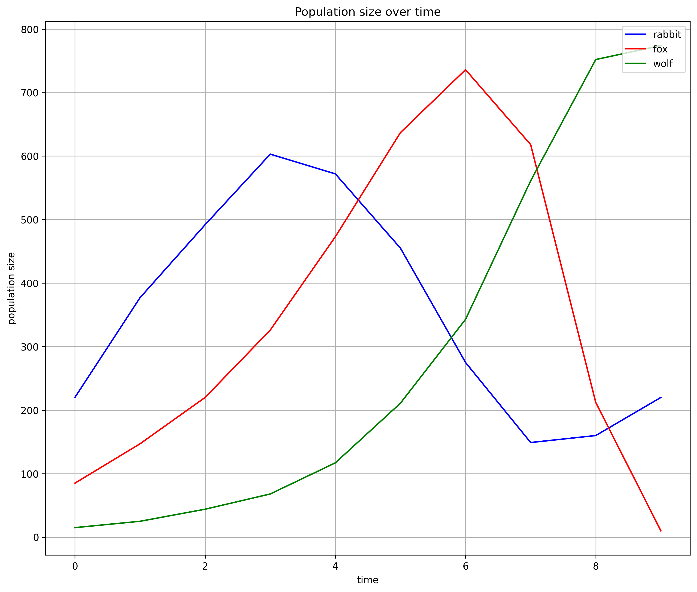
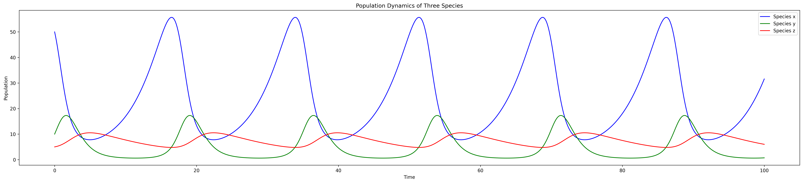
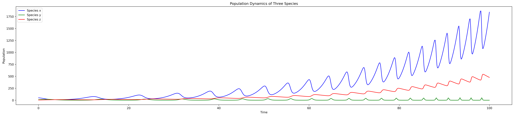

Dear professor,

I'm here to provide you with an update on the progress of our Food-Web project.
I have completed agent-based simulations of the food web, which involve three species: rabbits, foxes, and wolves. In this simulation, rabbits are preyed upon by foxes, while foxes are preyed upon by wolves. There is no direct interaction between rabbits and wolves. Each species is characterized by a set of parameters that dictate its behavior and life cycle.
For the rabbits, the parameters are:

```markdown
- x and y radius, which determine the area where the rabbits can observe the environment

- lifespan, which determines the time the rabbit can live

- speed, which determines the speed of the rabbit

- energy, which determines the energy of the rabbit

- number of offspring, which determines the number of offspring the rabbit can have

- new births per time step, which determines the number of new births the rabbit can have per time step

- birth energy cost, which determines the energy cost of giving birth to a new rabbit

- energy scaling factor, which determines the speed of energy gain from the environment

- energy reduction factor, which determines the speed of energy loss from the environment

- energy threshold for reproduction, which determines the energy threshold for reproduction
```
The parameter settings for foxes are similar to those for rabbits, but with species-specific variations. These include characteristics like speed, which are defined based on a mean and standard deviation and then generated using a seed.

The interaction rules are as follows:

```markdown
- Wolves hunt foxes first, then foxes hunt rabbits in the same way.

- For each wolf in each time step, find the prey(s) within the wolf's observation area. 
The observation area is a rectangle with the wolf at the center and the length and width of the rectangle equal to the wolf's x and y radius.
```

```markdown
- If nearby preys can satisfy the wolf's hunger, the wolf will gain energy from every one of them based on wolf's need and the distance between the wolf and the prey.
  That is, calculate the needed energy for the wolf, and then compare it with the sum of the energy of the nearby preys. 
  If the sum of the energy of the nearby preys is greater than the needed energy, the wolf will gain energy from the nearby preys based on the distance between the wolf and the prey. 
  Otherwise, all nearby preys will be eaten by the wolf, then the wolf will seek other preys and move towards the nearest prey.
  If no prey is within the wolf's observation area, the wolf will seek other preys and move towards the nearest prey.
  If the wolf does not need energy in the current time step, the wolf won't move.
  
- Foxes hunt rabbits in the same way. For each rabbit, if there is no enemy nearby, it won't move. 
  If there is an enemy nearby, it will run away from the enemy.

- If one animal's energy is less than 0, it will die.

- If one animal is too old, it won't move.
```
Reproduction rules are as follows:

```markdown
- Its energy is greater than the energy threshold for reproduction.
- It has the chance to give birth to a new animal or multiple new animals based on its potential number of offspring.
- Its energy must cover the energy cost of giving birth to (a) new animal/animals.
```
That's all. One notable challenge in the simulation is the computational burden of finding the nearest animal, which becomes especially pronounced with larger populations. To address this, I simplified the process by using absolute differences in coordinates rather than calculating Euclidean distances. (I simply check abs(x1-x2) and abs(y1-y2) to find the nearest animal.)
Before using manhattan distance, I tried neo4j graph database to store the agents and their relationships. But it's not efficient. So I gave up using neo4j.

This 3 species model incorporates a total of 66 parameters, I did some parameter exploration and found that the model is very unstable. **One of the species will die out in a short time.**
Rabbits can grow exponentially, foxes will die if no rabbits are alive, and wolves will die if no foxes are alive.


**It's hard to find an equilibrium among these three species.**

Even in theory, it's hard to find an equilibrium by differential equations. 
```markdown
# dxdt = a*x - b*x*y
# dydt = -c*y + d*x*y - e*y*z
# dzdt = -f*z + g*y*z
```
For example, by using
```markdown
a = 0.25
b = 0.05
c = 0.05
d = 0.02
e = 0.06
f = 0.1
g = 0.02

```
we can get


But by using
```markdown
a = 0.4
b = 0.05
c = 0.05
d = 0.02
e = 0.06
f = 0.1
g = 0.02
```


You see, by slightly changing parameter `a` from 0.25 to 0.4. It doesn't work. 3-species model is far more complex than I have expected.
