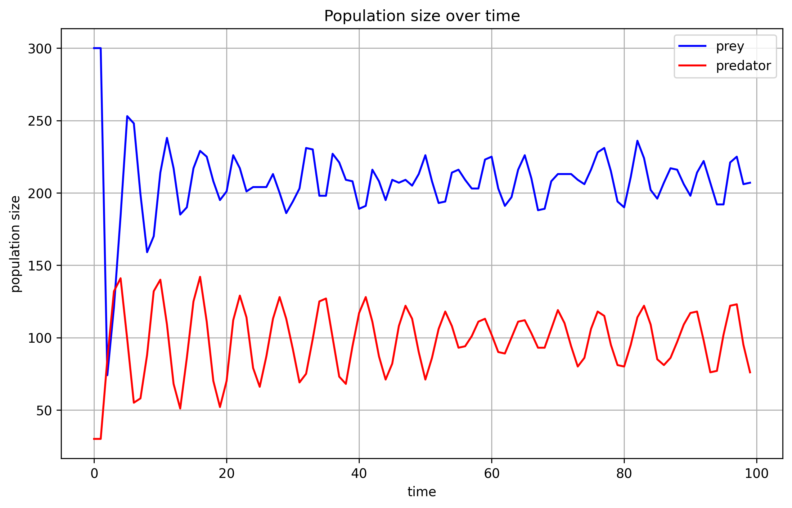

# Single species
```markdown
Initial number of individuals: 100
Average life span: 8
Average number of offspring: 2
Population limit: 1000
Time limit: from 0 to 100
x_grid_size: 100
y_grid_size: 100
```
At time 0, there are 100 individuals alive. Each agent's death time is determined by 'current time + np.random.posson(average life span)". Of course, it could be some other distributions. I just use the possion distribution for now. The number of potential offspring for each individual is determined by `np.random.poisson(average number of offspring)`.
Each agent also has its location, it moves around randomly on a fixed grid. 

At time 1, each agent might give birth to some offspring. Each time it will only give birth to one offspring. It could be some other parameters. The chance for this offspring to born is `1 - current pop size / pop limit`. If a child is born, it will be born near its parent. The location of the child is its parent's location (x+location_noise, y+location_noise). If the child is born outside the grid, then it will be born at the edge of the grid. If the child is not born, then parent's number of potential offspring will be reduced by 1.
Finally, check if any agent is dead at time 1. If it is, then remove it from the population.

At time 2, similar to time 1.....

Since there is no shortage of food, and nor enimies, the population size will increase. But it cannot increase forever because population limit exists. 


# Two species
Let's say foxes are the predator and rabbits are the prey. The foxes eat the rabbits.
```markdown
rabbit_search_radius: the range for a rabbit to live
fox_search_radius: the range for a fox to hunt
rabbit_max_search_radius: the maximum range for a rabbit to live
fox_max_search_radius: the maximum range for a fox to hunt
rabbit_speed: the speed for a rabbit to run away
fox_speed: the speed for a fox to hunt
fox_population_limit: 1000
rabbit_population_limit: 1000
```

Each rabbit has a circle around it, basically, it is the rabbit's range for a living.
Each fox has a circle around it,and it is the fox's range for hunting.
The range is different from one individual to another as you can see from the above picture.

At one time step, the hunting process is as follows:

1. For each fox, check if there is any rabbit in its hunting range. Calculate the distance between the fox and the rabbit. If the distance is smaller than `fox's hunting range + rabbit's living range`, then this rabbit will die at the time step. The key is `the number of potential offpsring` for this fox will be increased by 1. The `number of potential offspring` for this rabbit will be set to 0. The rabbit will be removed from the population at the end of the time step. Currently, one fox only need one rabbit to survive.This means if there are 10 rabbits in the fox's hunting range, the fox will only eat one of them. The rest of the rabbits will be alive. This could be changed later.
2. If it hunts no rabbit successfully but a rabbit is in `rabbit_max_search_radius + fox_max_search_radius`, then the fox will move towards the rabbit by fox_speed, the rabbit will run away from the fox by rabbit_speed.
something like this:

```python
prey_speed = 2
predator_speed = 3
angle = np.arctan2(prey.y - predator.y, prey.x - predator.x)
prey.x = prey.x + np.cos(angle) * prey_speed
prey.y = prey.y + np.sin(angle) * prey_speed
predator.x = predator.x + np.cos(angle) * predator_speed
predator.y = predator.y + np.sin(angle) * predator_speed
```
3. If it hunts no rabbit successfully in continous 4 time steps, then the fox will die despite its death time. This parameter could be changed later.

The breeding process is similar to the single species model. 

That's all.


# Summary

I think as long as you make one species' offspring depend on another species, then you will get the curve you want.
The same idea can be extended to 3 species model, even more. The rest is just parameters tuning.


